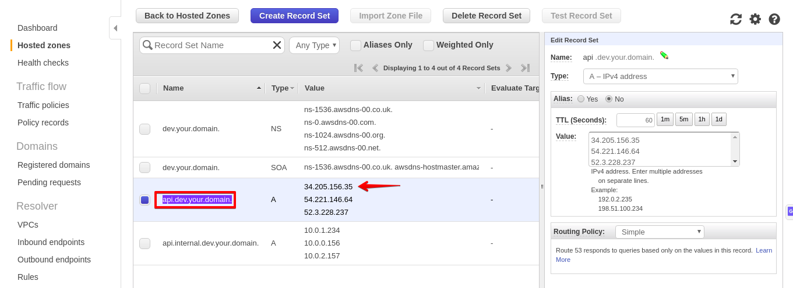

# Terraform k8s-aws-examples
---
## Description:
Mix of Terraform and Kops examples for deploying **Kubernetes** cluster from scratch with control-plane nodes.

---
#### **NOTE:**

Kops - you will need only if you want to try to deploy cluster with `kube-kops-example`.
<br />

This examples are used AWS services which are **NOT** a `free tier` (K8s has hardware requirements). So, do not forget to delete your cluster if you don't use it. 

---
---
## Requirements:


Terraform >= v0.12.24 [Hashicorp Terraform](https://www.terraform.io/)
<br />
Kops ~> v1.16.2 [Kops Page](https://github.com/kubernetes/kops/releases)
<br />
Python >= 3.7 [Python Page](https://www.python.org/)
<br />
Pip 3 >= 19.2.3 
<br />
aws-cli >= 1.18.58
<br />
kubectl >= 1.16 

---

## Project structure:
```bash
k8s-aws-example
├── README.md
├── global <-- Data resource for whole projects (like network, S3 for all, etc.)
│   └── network 
│       ├── backend.tf
│       ├── main.tf
│       ├── output.tf
│       ├── provider.tf
│       ├── terraform.tfvars
│       ├── terraform_init.py < -- Initial creating S3 and DynamoDB table for backend.
│       └── vars.tf
├── kube-example <-- K8s project with Kubeadm provisioner. 
│   ├── backend.tf
│   ├── main.tf
│   ├── output.tf
│   ├── provider.tf
│   ├── terraform.tfvars
│   └── vars.tf
├── kube-kops-example <-- K8s project with Kops provisioner.
│   ├── backend.tf
│   ├── main.tf
│   ├── output.tf
│   ├── provider.tf
│   ├── terraform.tfvars
│   └── vars.tf
├── modules <-- All re-usable code.
│   ├── k8s
│   │   ├── k8s.tf
│   │   ├── output.tf
│   │   └── vars.tf
│   ├── k8s-kops
│   │   ├── k8s-kops.tf
│   │   ├── output.tf
│   │   └── vars.tf
│   ├── s3
│   │   ├── output.tf
│   │   ├── s3.tf
│   │   └── vars.tf
│   └── vpc
│       ├── output.tf
│       ├── vars.tf
│       └── vpc.tf
└── requirements.txt

```

## How to use:
For running new cluster in AWS, you have to have  pre-configured AWS acconut on your machine (How to setup account via CLI you can find [here](https://docs.aws.amazon.com/cli/latest/userguide/cli-chap-configure.html)).
<br />
- First, install all necessary requirements.(You can use [Python virtula env](https://docs.python.org/3/tutorial/venv.html) or install globaly).
```bash
$ pip3 install -r requirements.txt
```
- Next, go to `global/network` and run `terraform_init.py`. 
```bash
$ python terraform_init.py
Output:

===== Terraform init Script =====
For more options use terraform_init.py --h 

Bucket with default name terraform-state-40kpv has been created

Table with default name terraform-state-lock has been created
```
This script has created **S3** bucket and **DynamoDb** table for Terraform remote backend usage (**S3** for storing remote stage and **DynamoDB** table for locking).
By default script will use for **S3** - `terraform-state-random` name (S3 name has to be uniq across all regions) and `terraform-state-lock` name for **DynamoDB** , but you can easy  change it, just run this script with `-n` flag and `name`
<br />

***Example:***
```bash
$ python terraform_init.py -n some-name
Output:

===== Terraform init Script =====
For more options use terraform_init.py --h 

Bucket some-name-otzd4 has been created

Table some-name-lock has been created
```
- Now we have bucket and table names and can configure `backend.tf` in `global/network`

```bash
terraform {
  backend "s3" {
    bucket         = "terraform-state-40kpv" <-- "generated S3 bucket name" 
    key            = "global_network"
    region         = "your_region" <-- "AWS region"
    dynamodb_table = "terraform-state-lock" <-- "generated table name"
  }
}
```
- After that, we can create our network (VPC, Subnets, Route table etc.).
<br />
Run `terraform init`, `terraform plan` and `terraform apply` inside `global/network` directory and wait for ending setup process.

- So, we have crated network and now we are ready for deploying K8s cluster.
We can use for this one of two projects(`kube-example` or `kube-kops-example`).<br />

#### *`kube-example: `*
Will provide K8s cluster provisioned by **Kubeadm** in ***private*** subnets with **ELB** in ***public*** subnets and as result in the `kube-example` directory (root module path) you will see `admin.conf` file - **Kubernetes** configuration.

<br />

#### *`kube-kops-example:`* 
Will provide  ***public*** K8s cluster provisioned by Kops.
<br />
*NOTE:* Kops need a real DNS name and this is will need extra payments if you don't have already bought DNS zone. In our example we are not going to use real domain name instead we will use private DNS. In this case you can use some fake-domain.com as your domain.

 #### *Exmple of **`kube-example`** usage:*
 Go to `kube-example` directory and adjust `backend.tf` as we've done it in `network`. After, take a look on `vars.tf` and `terraform.tfvars ` and change/add values in the `terraform.tfvars ` which will be more fit for your needs. 
 <br />

 Next, run `terraform init`, `terraform plan` and `terraform apply`.
 As a result, in working directory (`./kube-example`) you will see kube config file called `admin.conf`.
 <br />

 Now you can check to your cluster :
 ``` bash
 $ kubectl get nodes --kubeconfig /path/to/admin.conf
 Output:
 NAME                         STATUS   ROLES    AGE   VERSION
master                       Ready    master   14m   v1.18.2
worker-0                     Ready             14m   v1.18.2
worker-1                     Ready             14m   v1.18.2

```
<br />

After using you can delete cluster running `terraform destroy` inside `kube-example` directory.
<br />
  
 #### *Exmple of **`kube-kops-example`** usage:*
 Go to `kube-kops-example` directory and adjust `backend.tf` as we've done it in `network`. After, take a look on `vars.tf` and `terraform.tfvars ` and change/add values in the `terraform.tfvars ` which will be more fit for your needs. 
 <br />
 
 Next, run `terraform init`, `terraform plan` and `terraform apply` and as output you will see number of worker and master nodes, cluster name and **S3** bucket name  for **Kops** state file.
 <br />

 After successfully completed you can try run command:
 ``` bash
 $ kubectl get nodes
Output:
...
Unable to connect to the server: dial tcp: lookup api.dev.your.domain on 8.8.8.8:53: no such host
```
This error arose because the hosted zone is private. For fixing this, go to *AWS Console* -> *Route53* and find your your records like here:
 
Then, add *your_domain_name* and *IP* to `/etc/hosts`.
```bash
 $ echo “34.205.156.35 api.dev.your.domain” >> /etc/hosts
 ```
 And re-try command
 ```bash
 $ kubectl get nodes
 Output:
NAME                         STATUS   ROLES    AGE   VERSION
ip-10-0-0-156.ec2.internal   Ready    master   10m   v1.18.2
ip-10-0-1-234.ec2.internal   Ready             10m   v1.18.2
ip-10-0-2-157.ec2.internal   Ready             10m   v1.18.2
```
Done!
<br />

For deleting **Kops** K8s cluster you have to run:
```bash
$ kops delete cluster --name *your_domain_name*  --state s3://*kops_state_bucket_name*  --yes
# Inside kube-kops-example directory run
terraform destroy
```
<br />

For deleting `network`, go to `global/network` and run `terraform destroy`.

---
---
## TO DO:
 - Implement HA in `kube-example`
 - Implement `Terragrund` for flexibility
